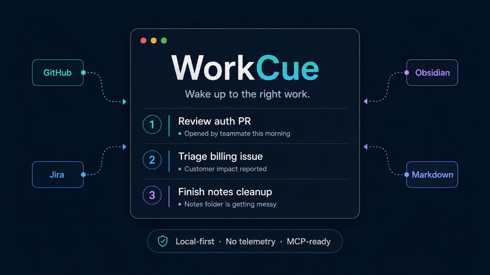

# WorkCue

<p align="center">
  <a href="README.md"></a>
  <a href="README.ko.md"></a>
</p>

<p align="center">
  
  
  
  
  
  
  
  
</p>

<p align="center">
  
</p>

업무 도구는 그대로, 오늘 할 일만 자동으로.

WorkCue는 Jira, GitHub, Obsidian 같은 기존 업무 도구에 흩어진 일을 읽고, 오늘 집중해야 할 작업을 근거와 함께 추천하는 로컬 우선 morning planner입니다. 새로운 todo 앱이나 칸반 보드를 만들지 않습니다. 이미 쓰는 업무 시스템을 source of truth로 유지하고, 그 위에 아침 브리핑 레이어를 얹습니다.

## Demo

내장 fixture만으로 실행할 수 있습니다. API token이나 외부 서비스가 필요 없습니다.

```bash
pnpm install
pnpm demo --date 2026-05-29
```

CLI package를 직접 실행할 수도 있습니다.

```bash
pnpm today --demo --date 2026-05-29
```

로컬 Obsidian vault의 unchecked task를 읽으려면:

```bash
pnpm today --obsidian-vault /path/to/vault --date 2026-05-29
```

Notion 칸반 데이터베이스나 data source를 읽으려면:

```bash
export NOTION_TOKEN="secret_..."
pnpm today --notion-board "https://www.notion.so/workspace/Tasks-0123456789abcdef0123456789abcdef" --date 2026-05-29
```

WorkCue는 Notion row의 title, status, due date, priority, assignee, project, labels, estimate 같은 속성을 읽습니다. 이 preview에서는 page body 내용 전체를 읽지 않습니다.

brief를 만들기 전에 정규화된 source item만 확인하려면:

```bash
pnpm sync --demo --date 2026-05-29
```

sync 결과를 로컬 SQLite cache에 저장하려면:

```bash
pnpm sync --demo --date 2026-05-29 --cache .workcue/workcue.sqlite
```

특정 추천 항목의 점수 근거를 설명하려면:

```bash
pnpm explain github:pr-184 --demo --date 2026-05-29
```

Obsidian connector는 이런 markdown task를 읽습니다.

```markdown
- [ ] Review billing PR #work 2026-05-30 [estimate:: 25m]
- [ ] Follow up with design #waiting [due:: 2026-05-31]
```

brief를 markdown 파일로 저장하려면:

```bash
pnpm today --obsidian-vault /path/to/vault --output ./briefs/2026-05-29.md
```

기존 Obsidian daily note에 WorkCue block만 upsert하려면:

```bash
pnpm today --obsidian-vault /path/to/vault --daily-note /path/to/vault/Daily/2026-05-29.md
```

반복 실행 시 `<!-- workcue:start -->`부터 `<!-- workcue:end -->` 사이의 managed block만 교체됩니다. 사용자가 직접 작성한 note 내용은 보존됩니다.

예시 출력:

```markdown
# WorkCue Morning Brief - 2026-05-29

Top recommendation: Review PR #184: Fix payment retry race condition

## Today's Focus

1. Review PR #184: Fix payment retry race condition
   Why now:
   - 사용자 리뷰가 요청된 항목입니다.
   - 현재 milestone에 포함된 작업입니다.
   - production 영향이 있는 작업입니다.
```

## 현재 범위

- TypeScript와 pnpm 기반 monorepo
- WorkItem, Signal, Recommendation, Brief core model
- deterministic demo scoring
- Obsidian markdown task connector
- GitHub Issues/PR connector
- Jira issue connector
- Notion kanban database/data source connector preview
- Markdown morning brief renderer
- Markdown file output
- Obsidian daily note upsert
- MCP stdio server: `workcue_sync`, `workcue_today`, `workcue_explain`, `workcue_doctor`
- sync 결과용 로컬 SQLite cache
- 로컬 container 실행용 Dockerfile
- CLI commands: `workcue sync`, `workcue explain`, `workcue today --demo`
- CLI source options: `--obsidian-vault <path>`, `--notion-board <url-or-id>`

## 제품 원칙

- 새로운 todo 앱을 만들지 않습니다.
- 초기 버전은 read-first, write-later 원칙을 지킵니다.
- optional LLM summary보다 deterministic scoring을 먼저 수행합니다.
- 모든 추천에는 evidence가 있어야 합니다.
- local-first와 self-hostable을 기본으로 합니다.
- source와 output은 pluggable하게 확장합니다.

## 개발

```bash
pnpm install
pnpm build
pnpm typecheck
pnpm test
pnpm today --demo
```

## Alpha Release Check

WorkCue alpha package는 Node.js 24 이상을 기준으로 합니다.

```bash
pnpm install --frozen-lockfile
pnpm release:check
```

release check는 `dist` build, test, 공개 파일 개인정보 패턴 scan, compiled CLI와 MCP tool handler smoke, package tarball 생성, 임시 prefix 설치 검증까지 수행합니다.

## 로컬 설정

로컬 config 파일을 생성합니다.

```bash
pnpm --filter workcue dev init --output .workcue/config.yml
```

Obsidian과 output path를 함께 설정합니다.

```bash
pnpm --filter workcue dev init \
  --output .workcue/config.yml \
  --obsidian-vault /path/to/vault \
  --markdown-output ./briefs/{{date}}.md \
  --daily-note /path/to/vault/Daily/{{date}}.md
```

Notion 칸반 링크를 함께 설정할 수도 있습니다.

```bash
pnpm --filter workcue dev init \
  --output .workcue/config.yml \
  --notion-board "https://www.notion.so/workspace/Tasks-0123456789abcdef0123456789abcdef"
```

Notion token 값은 config에 저장하지 않고 환경변수에 둡니다.

```bash
export NOTION_TOKEN="secret_..."
```

config를 점검합니다.

```bash
pnpm doctor --config .workcue/config.yml
```

config 기반으로 실행합니다.

```bash
pnpm today --config .workcue/config.yml --date 2026-05-29
```

GitHub config는 token 값이 아니라 환경변수 이름만 저장합니다.

```yaml
sources:
  github:
    enabled: true
    tokenEnv: GITHUB_TOKEN
    owner: your-org
    repos:
      - your-repo
    user: your-github-login
```

Jira config도 credential 값이 아니라 환경변수 이름만 저장합니다.

```yaml
sources:
  jira:
    enabled: true
    baseUrl: https://your-domain.atlassian.net
    emailEnv: JIRA_EMAIL
    tokenEnv: JIRA_API_TOKEN
    jql:
      - assignee = currentUser() AND statusCategory != Done
```

Notion config는 board link나 ID와 token 환경변수 이름만 저장합니다.

```yaml
sources:
  notion:
    enabled: true
    tokenEnv: NOTION_TOKEN
    boards:
      - url: https://www.notion.so/workspace/Tasks-0123456789abcdef0123456789abcdef
        titleProperty: Name
        statusProperty: Status
        dueProperty: Due
        priorityProperty: Priority
        assigneeProperty: Owner
        projectProperty: Project
```

`workcue init`으로 생성되는 local config는 SQLite cache를 기본으로 켭니다.

```yaml
cache:
  sqlite:
    enabled: true
    path: .workcue/workcue.sqlite
```

deterministic scoring은 signal multiplier로 조정할 수 있습니다.

```yaml
scoring:
  signalWeights:
    review_requested: 1.3
    due_soon: 1.2
    waiting_external: 0.7
```

LLM summary는 기본적으로 꺼져 있습니다. OpenAI-compatible endpoint나 Ollama를 켜려면 `llm.enabled`를 설정하고 API key 값은 환경변수에 둡니다.

```yaml
llm:
  enabled: true
  provider: openai-compatible
  baseUrl: https://api.openai.com
  model: model-name
  apiKeyEnv: OPENAI_API_KEY
```

## MCP Server

WorkCue는 Codex, Claude Desktop, Cursor 같은 MCP client에서 같은 morning brief를 조회할 수 있도록 로컬 MCP server를 제공합니다.

제공 tools:

- `workcue_sync`: source를 읽고 raw connector payload 없는 normalized item summary를 반환합니다.
- `workcue_today`: demo data, Obsidian vault, configured sources에서 morning brief를 생성합니다.
- `workcue_explain`: 특정 work item의 deterministic score와 추천 근거를 설명합니다.
- `workcue_doctor`: 외부 source fetch 없이 config readiness를 점검합니다.

stdio server를 실행합니다.

```bash
pnpm mcp
```

MCP client config 예시입니다.

```json
{
  "mcpServers": {
    "workcue": {
      "command": "pnpm",
      "args": ["--dir", "/path/to/workcue", "mcp"]
    }
  }
}
```

tool arguments 예시입니다.

```json
{
  "demo": true,
  "date": "2026-05-29",
  "top": 3
}
```

`configPath`로 로컬 `.workcue/config.yml`을 지정할 수 있습니다. `GITHUB_TOKEN`, `JIRA_EMAIL`, `JIRA_API_TOKEN` 같은 credential 값은 환경변수에 두고, WorkCue config에는 환경변수 이름만 저장합니다.

## 문서

- [Automation](docs/automation.md)
- [Local cache](docs/cache.md)
- [Docker](docs/docker.md)
- [LLM summaries](docs/llm.md)
- [MCP server](docs/mcp.md)
- [Release guide](docs/release.md)
- [Scoring](docs/scoring.md)
- [Obsidian daily note recipe](docs/recipes/obsidian-daily-note.md)
- [GitHub PR review radar recipe](docs/recipes/github-pr-review-radar.md)
- [Notion kanban recipe](docs/recipes/notion-kanban.md)
- [Changelog](CHANGELOG.md)

프로젝트 하네스는 `.codex/harnesses/workcue-engineering/`에 있습니다. 로컬 경로는 Git에 올라가지 않는 `.codex/local.env`에만 둡니다. 공개 template은 `.codex/local.example.env`를 사용합니다.
